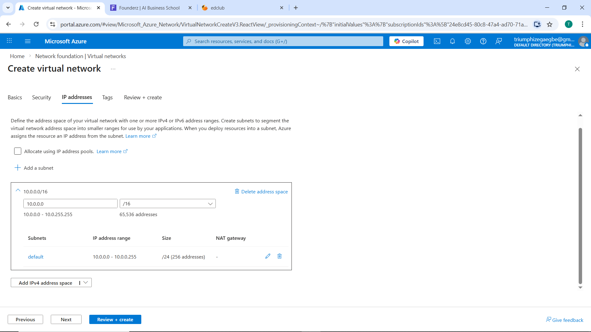
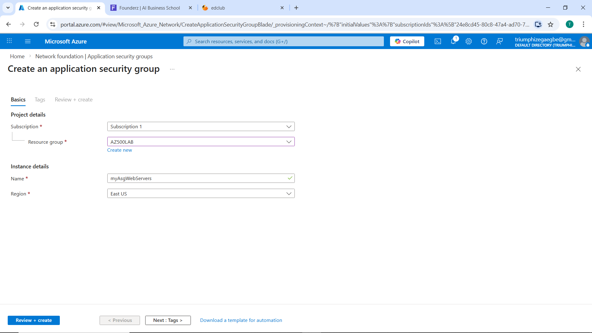
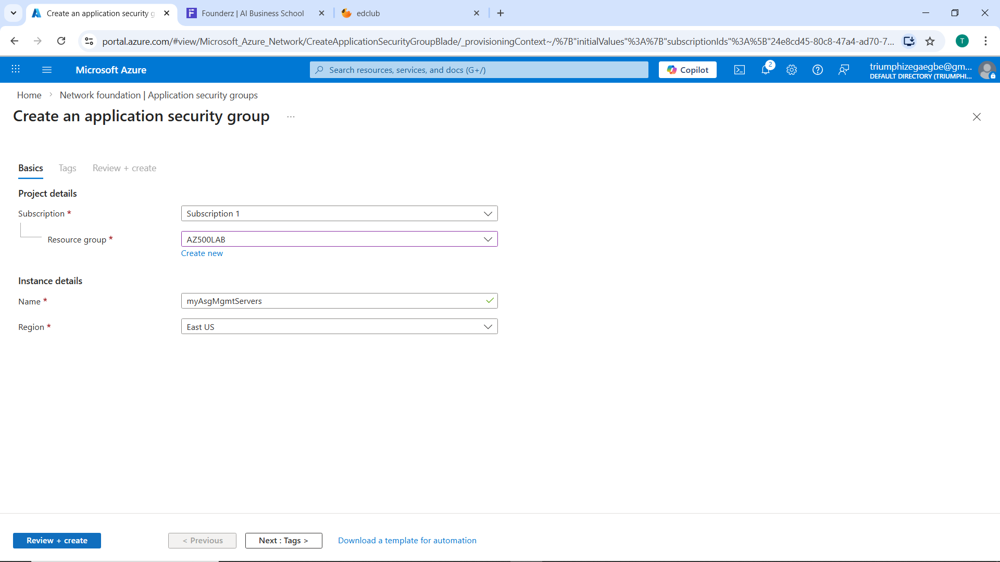
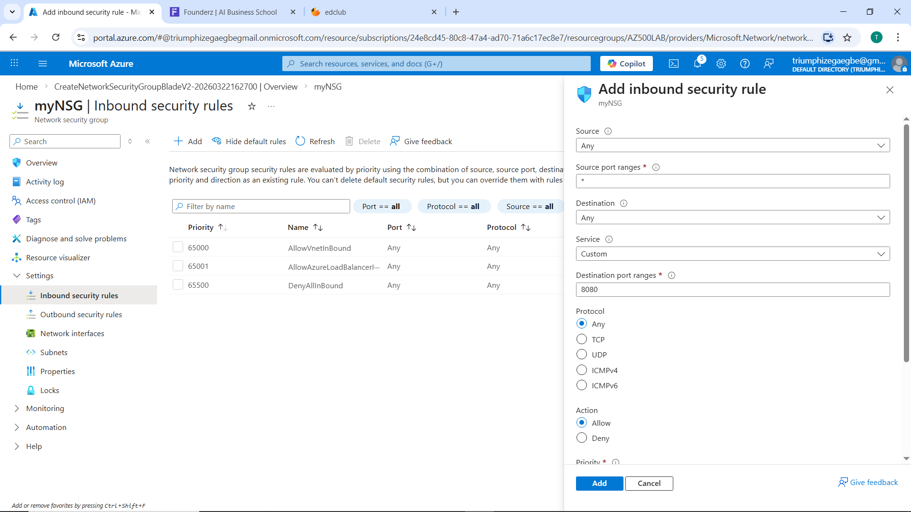
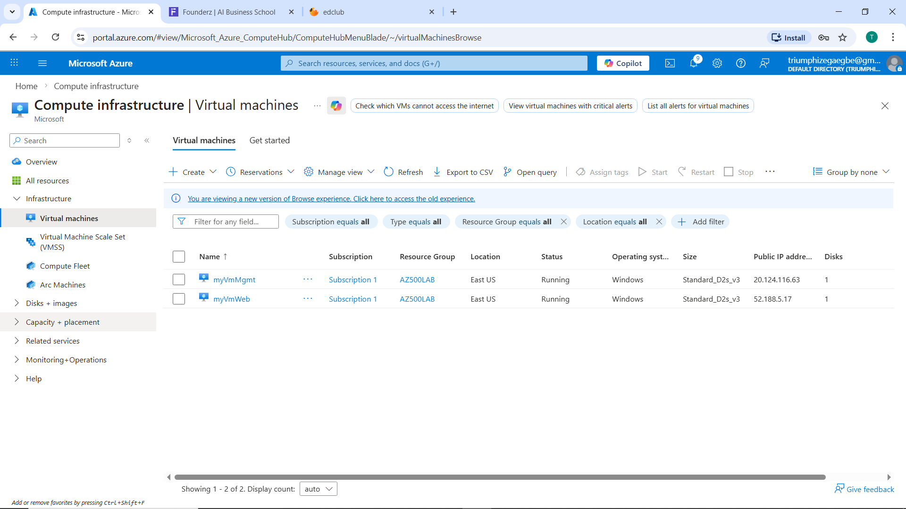
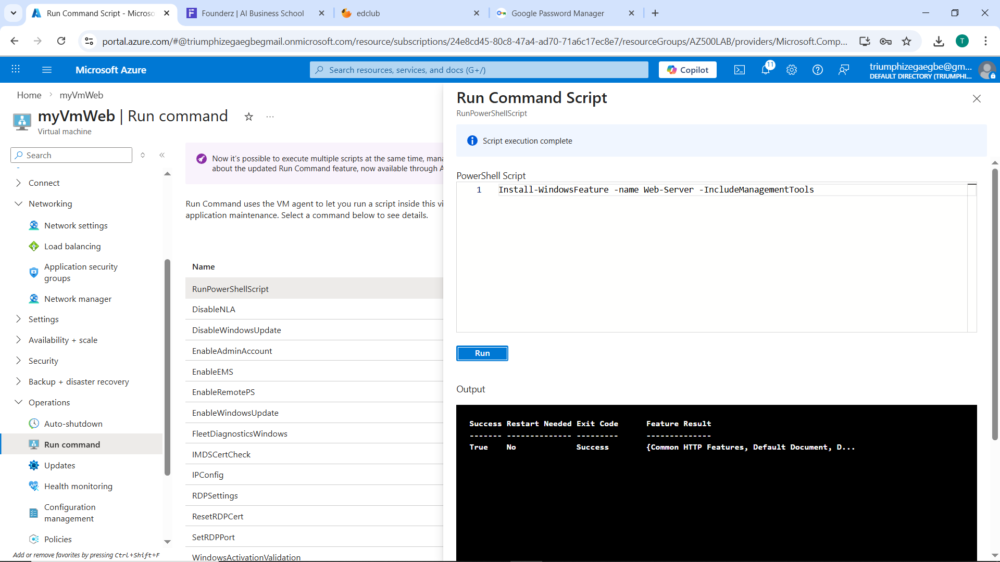
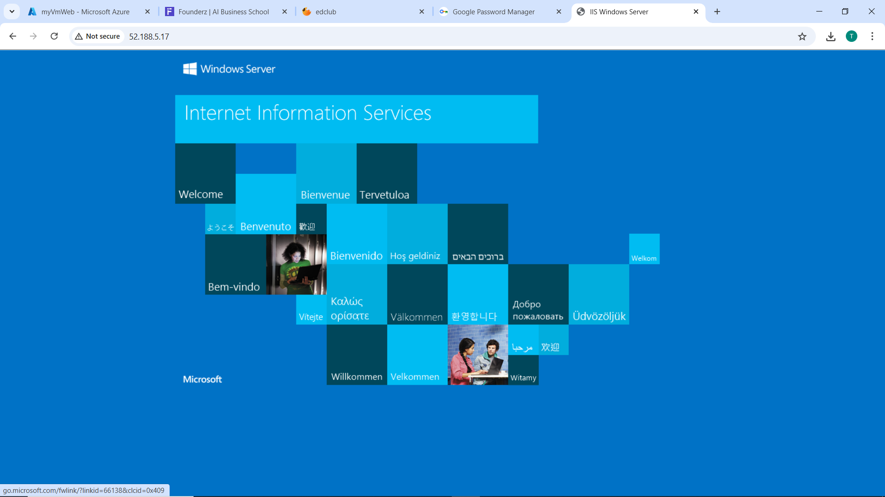

# Lab 01 — Network Security Groups and Application Security Groups

## Overview

This lab demonstrates how to secure Azure virtual machines using **Network Security Groups (NSGs)** and **Application Security Groups (ASGs)**. The goal is to allow HTTP/HTTPS to web servers and RDP to management servers while preventing cross-role access.

## Lab Scenario

The organization requires:

- Two groups of servers:

1. Web Servers — must be accessible from the internet via HTTP/HTTPS.

2. Management Servers — must allow administrators to connect via Remote Desktop (RDP).

- Each group of servers must be placed in its own Appplication Security Group ASG for logical grouping.

- RDP access must be allowed only to Management Servers.

- Web Servers must display the IIS default web page when accessed from the internet.

- Network Security Group (NSG) rules must enforce traffic control based on ASG membership.

## Lab Objectives

- Design a simple segmented network in Azure.

- Create ASGs for logical grouping of VMs (Web and Management).

- Create an NSG with rules targeting ASGs rather than individual IPs.

- Deploy two VMs and assign them to the appropriate ASGs.

- Validate that only intended traffic is allowed.

## Tools and Services

- Azure Portal

- PowerShell / RDP client

- curl / browser

## Steps Taken

1. Created resource group `AZ500LAB`.

2. Created VNet `myVNet` (10.0.0.0/16) and configured subnet `default` (10.0.0.0/24) within the VNet.

<strong>Figure 1: Create VNet </strong>

 

3. Created Application Groups (ASGs) named: `AsgWeb`, `AsgMgmt`.

<strong>Figure 2: Create ASG WebServer </strong>

 

<strong>Figure 3: Create ASG Management Server </strong>

 

4. Created a Network Security Group (NSG) `myNSG` and added inbound rules:

   - Allow TCP 80/443 → `AsgWeb`

   - Allow TCP 3389 → `AsgMgmt`

<strong>Figure 4: Create NSG rules </strong>

 

5. Associated `myNSG` with `mySubnet`.

6. Deployed Web Server VM `VmWeb` and Management server VM `VmMgmt` and assigned it to `AsgWeb` and `AsgMgmt` respectively.

<strong>Figure 5: Create VMs </strong>

 

7. Installed IIS role on the Web Server.

<strong>Figure 6: IIS install </strong>

 

8. Tested RDP access:

- Successful connection to Management Server.

<strong>Figure 7: RDP connect </strong>

 

9. Tested web access

- IIS default page successfully displayed from internet browser.

<strong>Figure 8: IIS server </strong>

 

## Security Outcome

1. Role based acccess enforced: Web servers only accept web traffic, management servers only accept RDP.

2. Least privilege Principle Applied: Only required ports are opened to each role (HTTP/HTTPS for Web; RDP for Management).

3. Scalability achieved: Adding new servers requires only ASG assignment, not NSG modification.

4. Centralized policy manageement: NSG rukes apply consistently across the subnet.

## Key Lessons Learned

1. ASGs simplify management. You manage rules by roles not by IP.

2. NSGs are stateful. Return traffic for allowed inbound flows is automatically permitted.

3. Rule priority matters. NSG rules are evaluated by priority number; misordered priorities can unintentionally block traffic.

4. Testing is essential. Always validate with real traffic.

5. Avoid overlapping rules. Conflicting rules (e.g., a deny with higher priority) can override intended allows.

## Conclusion
The lab successfully implemented role‑based network segmentation in Azure using Application Security Groups (ASGs) and a single Network Security Group (NSG). Web servers placed in AsgWeb received inbound HTTP/HTTPS traffic and displayed the IIS default page. Management servers placed in AsgMgmt accepted RDP connections only. NSG rules referencing ASGs enforced the intended access model without per‑VM rule changes.

